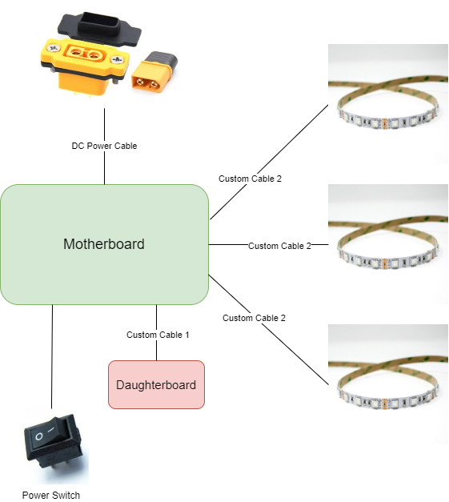

# Server Rack Controller

# Summary

This design is for a server rack controller. The design is based around the STM32F103C8T6 microcontroller. The design is split into three different designs, the Veroboard design, the module based design and the components based design. The Veroboard design is the simplest design and is the easiest to build utilising off the shelf components and some veroboards. The module based design is the next stage in the design process turning it into a Printed Circuit Board. The final stage is a complete Printed Circuit Board using the individual components and no daughter boards.

# Hardware Architecture

The Architecture of this system is shown below:

<center>
    
</center>
# Repository Structure

The repository is split into the different designs. The designs are as follows:

```bash
├── README.md
├── docs
├── Components Based Design
├── Module Based Design
└── Veroboard Based Design
```

# Server Rack Controller In Action
 
 We can see the Server Rack Controller in action below, where the verboard design was used.
<center>
    
</center>

# Useful Links

- [Thingiverse](https://www.thingiverse.com/scottgibb/designs)
- [3D Printable Case](https://www.thingiverse.com/thing:5936206)
